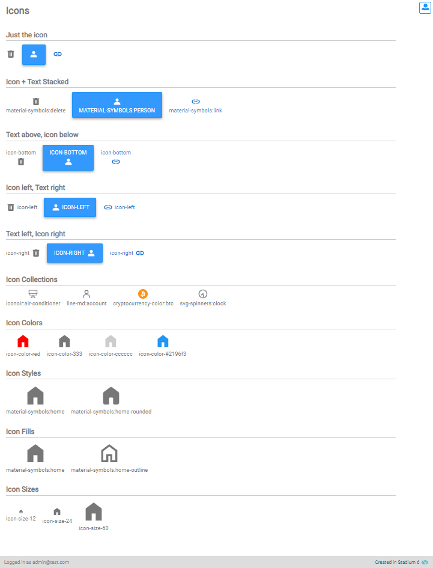
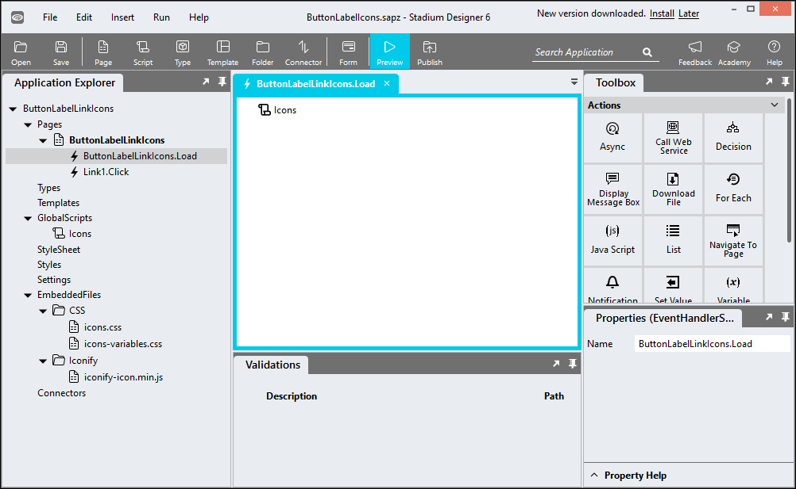
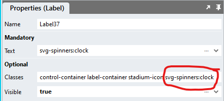

# Button, Label and Link Icons

A repo to show how to display icons in *Button*, *Label* and *Link* controls

## Examples


## Dependency
To display icons in *Button*, *Label* and *Link* controls, the [Icons Module](https://github.com/stadium-software/icons) must be implemented in the application



## Version 
1.0 - initial

# Setup

## Application Setup
1. Check the *Enable Style Sheet* checkbox in the application properties

## Page.Load Setup

1. Drag the Global Script called "Icons" into the Page.Load event handler
2. Leave the input parameter blank (this parameter is only used by other scripts)
3. Drag a *Label*, *Button*, *Link* or *Container* control into the page
4. Add the class 'stadium-icon' to the control classes property
5. Find a symbol you wish to display: see [finding and icon](https://github.com/stadium-software/icons?tab=readme-ov-file#finding-an-icon)
6. Paste the name of the symbol into the control classes property (e.g. 'material-symbols:wifi-sharp' or 'material-symbols:undo')



## Icon Styles

Additional classes can be added to the control classes property to manipulate the icon

1. Positioning
   1. By default the icons are shown above the control text where such text exists. This can also be achieved by adding the class *icon-top*
   2. *icon-left*: places the icon to the left of the text in the control
   3. *icon-right*: places the icon to the left of the text in the control
   4. *icon-bottom*: places the icon under the text
2. Size
   1. The default icon size is 24px x 24px
   2. *icon-size-xx* allows you to define a custom icon size in pixels (e.g. icon-size-12 for 12px by 12px or icon-size-40 for 40px by 40px)
3. Color
   1. The default icon color is inherited by the page
   2. *icon-color-######* allows you to define a custom icon color in hex (e.g. icon-color-#FFFF00, icon-color-ccc or icon-color-red)

*Examples*
```
stadium-icon material-symbols:home icon-size-40 icon-color-black icon-left
```
```
stadium-icon material-symbols:delete-forever icon-size-20 icon-color-ffffff
```